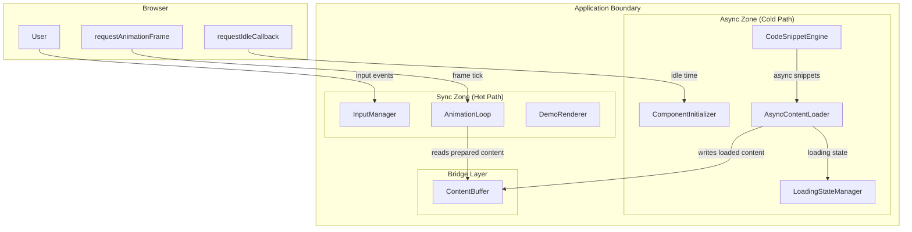
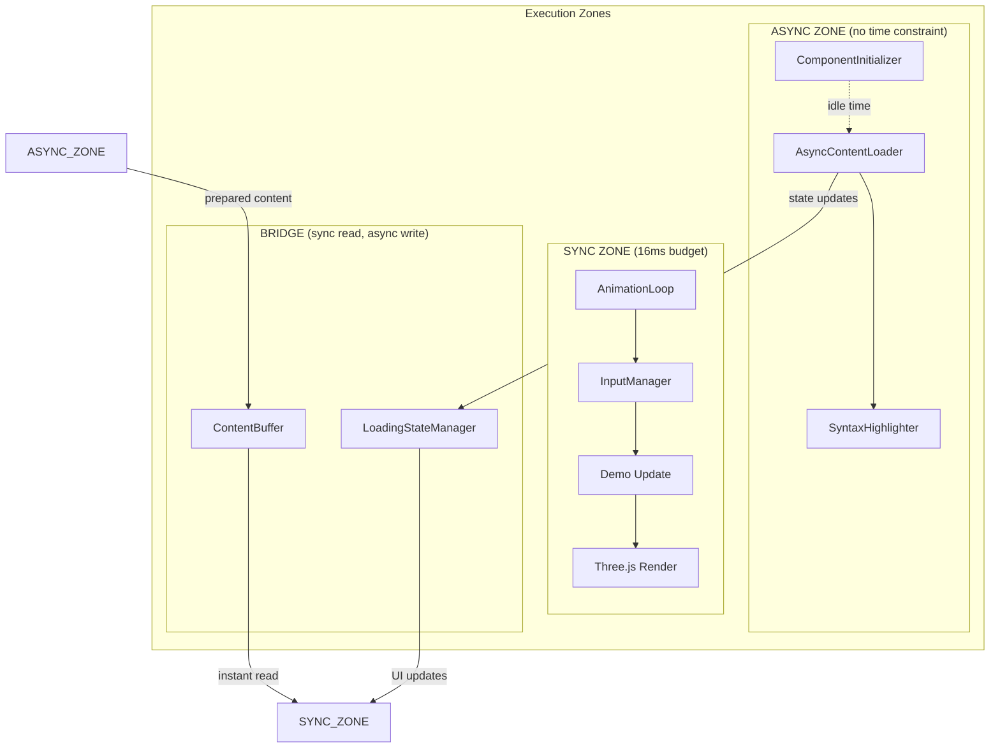
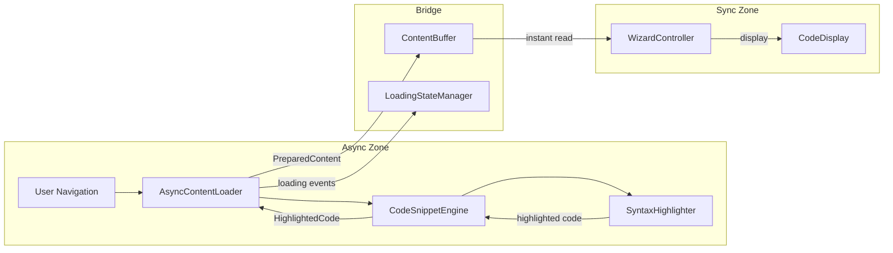

# Architecture Document: Async Optimization

> This document defines HOW the system will be built. It implements requirements from the PRD without inventing new features.

---

## Executive Summary

This architecture defines strategic async adoption zones within the existing synchronous-core application. The approach preserves the performant `requestAnimationFrame`-based animation loop while introducing async patterns for content loading, component initialization, and resource pre-warming. A clear boundary model separates "must-be-sync" hot paths from "should-be-async" cold paths.

---

## Requirements Mapping

> Every architectural element must trace to PRD requirements

| PRD Requirement | Architectural Approach | Component(s) |
|-----------------|----------------------|--------------|
| FR-001 Async Content Loading | Promise-based content pipeline with cancellation | AsyncContentLoader, CodeSnippetEngine |
| FR-002 Loading State Feedback | LoadingStateManager with threshold-based display | LoadingStateManager |
| FR-003 Async Component Init | Lazy initialization with requestIdleCallback | ComponentInitializer |
| FR-004 Sync/Async Boundaries | Zone-based architecture with documented boundaries | All (pattern) |
| NFR-001 60fps Animation | Synchronous render loop preserved | AnimationLoop (unchanged) |
| NFR-002 No Long Tasks | Chunked operations, idle-time scheduling | AsyncContentLoader |
| NFR-003 No Async in Hot Path | Strict zone enforcement | AnimationLoop, InputManager |
| NFR-004 Loading Indicators | Delayed display (100ms threshold) | LoadingStateManager |
| NFR-005 Pattern Consistency | Documented patterns, consistent interfaces | All |

---

## System Context

### Context Diagram



### System Boundaries

| Inside System | Outside System | Integration Type |
|---------------|----------------|------------------|
| AsyncContentLoader | Browser Idle API | requestIdleCallback |
| AnimationLoop | Browser RAF | requestAnimationFrame |
| SyntaxHighlighter | Shiki Library | Async Import |

---

## Architecture Overview

### High-Level Architecture



### Architecture Style

**Pattern**: Zone-Based Async Boundary

**Rationale**: The application has a hard real-time requirement (60fps = 16.67ms frame budget) for animation, but content loading has no such constraint. By establishing explicit zones with a bridge layer, async operations never interfere with the render loop. See ADR-001.

---

## Components

### Component: AsyncContentLoader

| Attribute | Value |
|-----------|-------|
| **Purpose** | Coordinate async content loading without blocking main thread |
| **PRD Requirements** | FR-001, NFR-002 |
| **Technology** | TypeScript, Promises, AbortController |

**Responsibilities**:
- Load wizard step content asynchronously
- Cancel pending loads on navigation
- Coordinate with LoadingStateManager
- Write to ContentBuffer when ready

**Interfaces**:
| Direction | Type | Contract |
|-----------|------|----------|
| Input | Method call | `loadStep(stepId: string): Promise<StepContent>` |
| Input | Method call | `cancelPending(): void` |
| Output | Callback | `onLoadStart(stepId: string): void` |
| Output | Callback | `onLoadComplete(stepId: string, content: StepContent): void` |
| Output | Callback | `onLoadError(stepId: string, error: Error): void` |

**Dependencies**:
- CodeSnippetEngine: For async snippet retrieval
- LoadingStateManager: For loading state coordination
- ContentBuffer: For prepared content storage

### Component: LoadingStateManager

| Attribute | Value |
|-----------|-------|
| **Purpose** | Manage loading indicators with threshold-based display |
| **PRD Requirements** | FR-002, NFR-004 |
| **Technology** | TypeScript, setTimeout |

**Responsibilities**:
- Track loading operations by ID
- Delay loading indicator display by 100ms threshold
- Clear indicators immediately on completion
- Prevent indicator flash for fast operations

**Interfaces**:
| Direction | Type | Contract |
|-----------|------|----------|
| Input | Method call | `startLoading(id: string): void` |
| Input | Method call | `stopLoading(id: string): void` |
| Output | Callback | `onShowIndicator(id: string): void` |
| Output | Callback | `onHideIndicator(id: string): void` |

**Dependencies**:
- None (standalone utility)

### Component: ComponentInitializer

| Attribute | Value |
|-----------|-------|
| **Purpose** | Initialize non-critical components during idle time |
| **PRD Requirements** | FR-003, NFR-002 |
| **Technology** | TypeScript, requestIdleCallback |

**Responsibilities**:
- Queue component initialization tasks
- Execute during browser idle time
- Track initialization status
- Handle initialization failures gracefully

**Interfaces**:
| Direction | Type | Contract |
|-----------|------|----------|
| Input | Method call | `register(component: AsyncInitializable): void` |
| Input | Method call | `initializeAll(): Promise<void>` |
| Output | Callback | `onInitialized(componentId: string): void` |
| Output | Callback | `onInitFailed(componentId: string, error: Error): void` |

**Dependencies**:
- Browser requestIdleCallback API (with fallback)

### Component: ContentBuffer

| Attribute | Value |
|-----------|-------|
| **Purpose** | Bridge between async writers and sync readers |
| **PRD Requirements** | FR-001, NFR-001, NFR-003 |
| **Technology** | TypeScript, Map |

**Responsibilities**:
- Store prepared content from async operations
- Provide instant synchronous reads for render loop
- Manage content lifecycle (add/remove/clear)

**Interfaces**:
| Direction | Type | Contract |
|-----------|------|----------|
| Input | Method call | `set(key: string, content: PreparedContent): void` |
| Input | Method call | `get(key: string): PreparedContent \| undefined` |
| Input | Method call | `has(key: string): boolean` |
| Input | Method call | `clear(): void` |

**Dependencies**:
- None (pure data structure)

---

## Data Architecture

### Data Models

#### Entity: PreparedContent

```
PreparedContent
├── stepId: string (required)
├── snippets: HighlightedCode[] (required)
├── annotations: Annotation[] (optional)
├── preparedAt: number (timestamp)
└── expiresAt: number | null (optional TTL)
```

**Constraints**:
- stepId must be unique in ContentBuffer
- snippets array may be empty but not undefined

#### Entity: LoadingState

```
LoadingState
├── id: string (required)
├── startTime: number (timestamp)
├── timeoutId: number | null (setTimeout reference)
└── isVisible: boolean (indicator shown)
```

**Constraints**:
- isVisible becomes true only after 100ms threshold

### Data Flow



---

## Interface Specifications

### AsyncContentLoader Interface

```typescript
interface AsyncContentLoader {
  // Load content for a wizard step
  loadStep(stepId: string): Promise<StepContent>;

  // Cancel all pending operations
  cancelPending(): void;

  // Preload upcoming steps during idle time
  preloadSteps(stepIds: string[]): void;

  // Event callbacks
  onLoadStart(callback: (stepId: string) => void): void;
  onLoadComplete(callback: (stepId: string, content: StepContent) => void): void;
  onLoadError(callback: (stepId: string, error: Error) => void): void;
}
```

### LoadingStateManager Interface

```typescript
interface LoadingStateManager {
  // Start tracking a loading operation
  startLoading(id: string): void;

  // Complete a loading operation
  stopLoading(id: string): void;

  // Check if loading is in progress
  isLoading(id: string): boolean;

  // Event callbacks (called after 100ms threshold)
  onShowIndicator(callback: (id: string) => void): void;
  onHideIndicator(callback: (id: string) => void): void;
}
```

### AsyncInitializable Interface

```typescript
interface AsyncInitializable {
  // Unique identifier for this component
  readonly id: string;

  // Priority (lower = earlier initialization)
  readonly priority: number;

  // Whether this component is critical (blocks app start)
  readonly isCritical: boolean;

  // Async initialization method
  initialize(): Promise<void>;

  // Current initialization state
  readonly isInitialized: boolean;
}
```

---

## Architecture Decision Records

### ADR-001: Zone-Based Async Boundary

| Attribute | Value |
|-----------|-------|
| **Status** | Accepted |
| **Date** | 2025-12-28 |
| **Deciders** | Architect |

**Context**: The application must maintain 60fps animation while loading content asynchronously. Mixing async/await in the render loop would add microtask overhead and unpredictable delays.

**Decision**: Establish explicit "Sync Zone" and "Async Zone" with a ContentBuffer bridge. Async operations write to the buffer; sync operations only read from it.

**Consequences**:
- ✅ Render loop remains purely synchronous with predictable timing
- ✅ Async operations can take arbitrary time without affecting animation
- ✅ Clear mental model for developers (which zone am I in?)
- ⚠️ Content may not be immediately available (requires loading states)
- ⚠️ Slightly more complex data flow than direct async/await

**Alternatives Considered**:
| Alternative | Rejected Because |
|-------------|------------------|
| Async everywhere | Would add unpredictable delays to render loop |
| Web Workers only | Overkill for current needs; adds serialization overhead |
| Sync everywhere | Would block main thread during content loading |

### ADR-002: Threshold-Based Loading Indicators

| Attribute | Value |
|-----------|-------|
| **Status** | Accepted |
| **Date** | 2025-12-28 |
| **Deciders** | Architect |

**Context**: Loading indicators that flash briefly (appear and disappear in <100ms) create visual noise and make the UI feel slower than it is.

**Decision**: Delay showing loading indicators by 100ms. If the operation completes within 100ms, no indicator is shown. Clear indicators immediately on completion.

**Consequences**:
- ✅ Fast operations feel instant (no flash)
- ✅ Slow operations show clear feedback
- ✅ Consistent with perceived performance best practices
- ⚠️ Users don't see feedback for first 100ms of slow operations

**Alternatives Considered**:
| Alternative | Rejected Because |
|-------------|------------------|
| Immediate indicators | Creates visual noise for fast operations |
| Skeleton screens always | Adds complexity; not needed for text content |
| No indicators | Users confused during slow operations |

### ADR-003: requestIdleCallback for Non-Critical Init

| Attribute | Value |
|-----------|-------|
| **Status** | Accepted |
| **Date** | 2025-12-28 |
| **Deciders** | Architect |

**Context**: Some components (like Shiki highlighter pre-warming) should initialize in the background without blocking user interaction.

**Decision**: Use `requestIdleCallback` API for non-critical component initialization. Provide setTimeout fallback for browsers without support.

**Consequences**:
- ✅ Initialization happens during browser idle time
- ✅ User interaction is never blocked
- ✅ Components ready when needed (pre-warmed)
- ⚠️ No guarantee of when initialization completes
- ⚠️ Need fallback for Safari (no requestIdleCallback)

**Alternatives Considered**:
| Alternative | Rejected Because |
|-------------|------------------|
| Eager initialization | Blocks initial page render |
| Lazy initialization only | First use has delay |
| setTimeout(0) | Still competes with other main thread work |

### ADR-004: AbortController for Cancellation

| Attribute | Value |
|-----------|-------|
| **Status** | Accepted |
| **Date** | 2025-12-28 |
| **Deciders** | Architect |

**Context**: When users rapidly navigate between wizard steps, pending content loads should be cancelled to avoid wasted work and race conditions.

**Decision**: Use AbortController/AbortSignal pattern for all cancellable async operations. Cancel pending operations when new navigation occurs.

**Consequences**:
- ✅ Standard web API pattern (familiar to developers)
- ✅ Prevents race conditions from stale loads
- ✅ Reduces wasted computation
- ⚠️ Must propagate abort signals through async chain

**Alternatives Considered**:
| Alternative | Rejected Because |
|-------------|------------------|
| Ignore stale results | Wastes computation; potential race conditions |
| Custom cancellation tokens | Non-standard; reinventing the wheel |
| No cancellation | Memory leaks; wasted resources |

---

## Technology Stack

| Layer | Technology | Version | Purpose | License |
|-------|------------|---------|---------|---------|
| Runtime | Browser | Modern | Execution environment | N/A |
| Language | TypeScript | 5.x | Type-safe async code | Apache-2.0 |
| Async | Native Promises | ES2017+ | Async operations | N/A |
| Idle | requestIdleCallback | Native | Background initialization | N/A |
| Cancellation | AbortController | Native | Request cancellation | N/A |
| Animation | requestAnimationFrame | Native | Render loop (unchanged) | N/A |

---

## Non-Functional Requirements Implementation

### Performance (NFR-001, NFR-003)

| Requirement | Approach | Verification |
|-------------|----------|--------------|
| 60fps maintained | Sync zone has no async/await | Frame time profiling |
| No async in render loop | Zone boundary enforcement | Code review, static analysis |

### Responsiveness (NFR-002)

| Requirement | Approach | Verification |
|-------------|----------|--------------|
| No long tasks (>50ms) | Chunked async operations | Performance.measure() |
| Cancellable loads | AbortController pattern | Unit tests |

### Usability (NFR-004)

| Requirement | Approach | Verification |
|-------------|----------|--------------|
| Loading indicators | 100ms threshold display | Integration tests |
| Immediate hide | Callback on completion | Unit tests |

### Maintainability (NFR-005)

| Requirement | Approach | Verification |
|-------------|----------|--------------|
| Consistent patterns | Zone model, documented interfaces | Code review |
| Clear boundaries | Sync/async separation | Architecture review |

---

## Integration Points

| Component | Direction | Protocol | Integration Pattern |
|-----------|-----------|----------|---------------------|
| CodeSnippetEngine | Bidirectional | Async/Promise | AsyncContentLoader calls getSnippet() |
| SyntaxHighlighter | Inbound | Async/Promise | Pre-warmed via ComponentInitializer |
| WizardController | Outbound | Sync read | Reads from ContentBuffer |
| WizardNavigator | Inbound | Sync callback | Triggers loadStep() via callback |

---

## Risks and Mitigations

| ID | Risk | Probability | Impact | Score | Mitigation |
|----|------|-------------|--------|-------|------------|
| TR-001 | Race conditions from stale async results | Medium | High | 6 | AbortController cancellation pattern |
| TR-002 | Memory leaks from uncancelled callbacks | Low | Medium | 2 | Cleanup in dispose() methods |
| TR-003 | requestIdleCallback not supported | Low | Low | 1 | setTimeout fallback |
| TR-004 | Over-engineering simple operations | Medium | Medium | 4 | Profile first; apply only where needed |

---

## Coding Standards

### File Structure
```
src/
├── async/                 # Async zone components
│   ├── AsyncContentLoader.ts
│   ├── LoadingStateManager.ts
│   ├── ComponentInitializer.ts
│   └── ContentBuffer.ts
├── core/                  # Sync zone (unchanged)
│   ├── AnimationLoop.ts
│   └── InputManager.ts
├── wizard/                # Mixed (mostly async)
│   └── CodeSnippetEngine.ts
└── wizard-ui/             # Sync zone (DOM rendering)
    └── CodeDisplay.ts
```

### Naming Conventions
- Async methods: Return `Promise<T>`, use async/await internally
- Sync methods: Never return Promise, never use await
- Bridge components: Named with "Buffer" or "Cache" suffix
- Callbacks: Prefixed with `on` (e.g., `onLoadComplete`)

### Patterns to Follow

| Pattern | When to Use |
|---------|-------------|
| Zone boundary | All new async code must live in async zone |
| AbortController | Any cancellable async operation |
| Threshold display | All loading indicators |
| Callback arrays | Multi-subscriber events |
| Promise deduplication | Expensive one-time initialization |

### Anti-Patterns to Avoid

| Anti-Pattern | Why Avoid |
|--------------|-----------|
| async/await in AnimationLoop callbacks | Breaks 16ms frame budget |
| Fire-and-forget Promises | Memory leaks, unhandled errors |
| Sync blocking in async zone | Defeats purpose of async |
| Direct DOM manipulation in async callbacks | May cause layout thrashing |

---

## Sync/Async Boundary Guidelines (FR-004)

### MUST BE SYNCHRONOUS

| Component | Reason |
|-----------|--------|
| AnimationLoop.onFrame callbacks | 16ms frame budget |
| InputManager.getInputState() | Immediate response required |
| DemoRenderer.render() | GPU sync required |
| Demo.update() | Per-frame physics |
| Three.js scene operations | WebGL sync |

### SHOULD BE ASYNCHRONOUS

| Component | Reason |
|-----------|--------|
| Code snippet loading | Shiki highlighting is expensive |
| Wizard step content | May grow in size/complexity |
| Component pre-warming | Not time-critical |
| Resource preloading | Anticipatory loading |

### MAY BE EITHER

| Component | Guideline |
|-----------|-----------|
| DOM creation | Sync for small updates; async for large batches |
| Data transformation | Sync for simple; async if >5ms |
| Cache operations | Sync for reads; async for writes with persistence |

---

## Glossary

| Term | Definition |
|------|------------|
| Sync Zone | Code that runs in the animation frame callback; must complete in <16ms |
| Async Zone | Code that runs outside the frame callback; no time constraint |
| ContentBuffer | Bridge data structure for async→sync data handoff |
| Threshold Display | Pattern where loading indicators only show after 100ms delay |
| Pre-warming | Initializing expensive resources before they're needed |

---

## Open Questions

- [x] Q1: Should loading indicators be per-component or global?
  - Decision: Per-component via LoadingStateManager with unique IDs
  - Rationale: Allows fine-grained control and parallel loading states

---

## Approval

| Role | Name | Date | Status |
|------|------|------|--------|
| Architect | Claude | 2025-12-28 | Complete |
| Tech Lead | | | Pending |

---

## Workflow Checklist

- [x] All FR requirements have architectural approach
- [x] All NFR requirements have implementation strategy
- [x] System context diagram exists
- [x] Component diagram with clear boundaries
- [x] Data models specified
- [x] At least 3 ADRs documented (4 provided)
- [x] Technology choices justified
- [x] Risks identified with mitigations
- [x] Zero implementation code present

---

**Next Step**: `/scrum` to create User Stories
