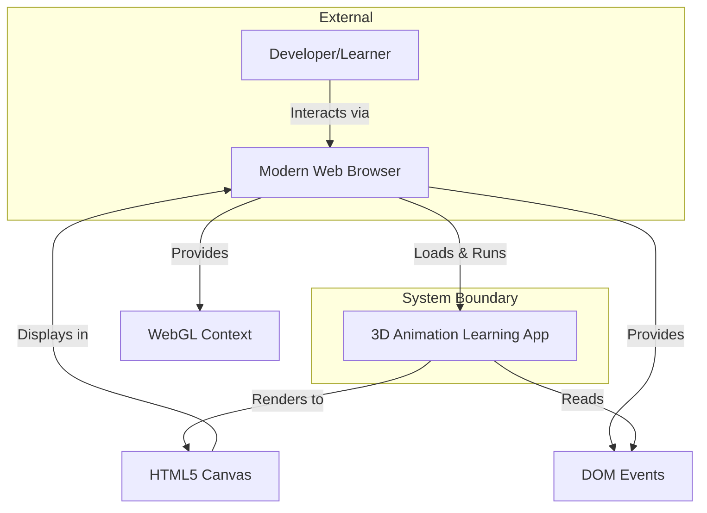
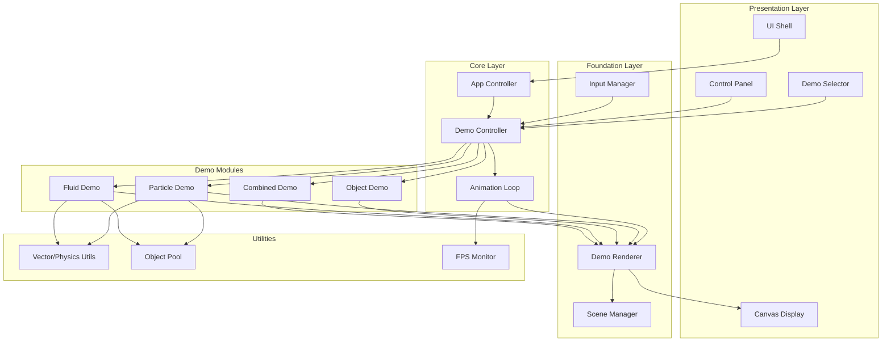
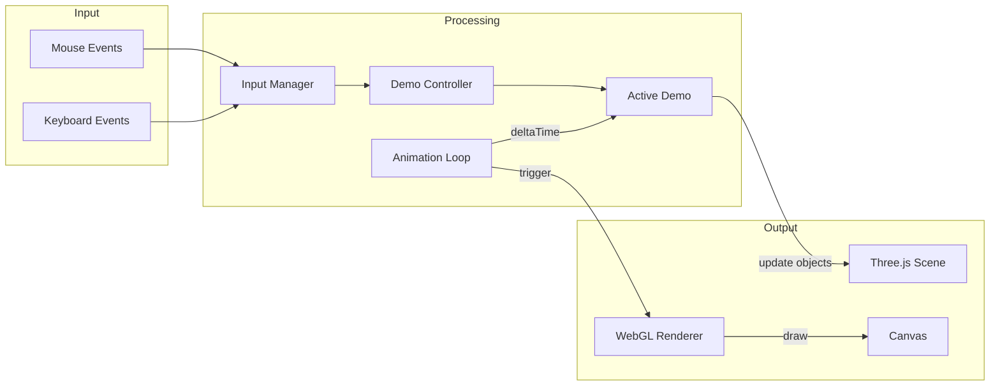

# Architecture Document

> This document defines HOW the system will be built. It implements requirements from the PRD without inventing new features.

---

## Executive Summary

The 3D Animation Learning Foundation is designed as a standalone single-page application (SPA) using Three.js for WebGL-based 3D rendering. The architecture emphasizes educational clarity over production optimization, with a modular component structure that isolates each demonstration type (particles, objects, physics) while sharing a common rendering and interaction framework. The codebase prioritizes readability and pattern extraction for future reuse in a car physics product.

---

## Requirements Mapping

> Every architectural element must trace to PRD requirements

| PRD Requirement | Architectural Approach | Component(s) |
|-----------------|----------------------|--------------|
| FR-001 (Particle System) | Dedicated ParticleDemo module with particle lifecycle management | ParticleSystem, DemoRenderer |
| FR-002 (3D Object Animation) | ObjectDemo module with transform animation engine | ObjectAnimator, DemoRenderer |
| FR-003 (Fluid Physics) | FluidDemo module with simplified SPH-like simulation | FluidSimulation, DemoRenderer |
| FR-004 (Interactive Controls) | Centralized InputManager handling mouse/keyboard events | InputManager, DemoController |
| FR-005 (Readable Code) | TypeScript with JSDoc, clear module boundaries, design patterns | All components |
| FR-006 (Standalone Operation) | Static SPA with bundled assets, no runtime dependencies | Build configuration, asset bundling |
| FR-007 (Combined Demo) | CombinedDemo orchestrating multiple subsystems | CombinedDemo, DemoController |
| FR-008 (Parameter Adjustment) | ControlPanel component with dat.gui-style interface | ControlPanel, DemoController |
| FR-009 (Visual Reset) | Reset capability in each demo module | DemoController, individual demos |
| NFR-001 (Performance) | Object pooling, efficient render loops, FPS monitoring | AnimationLoop, object pools |
| NFR-002 (Compatibility) | WebGL with fallback detection, modern ES modules | Core renderer, feature detection |
| NFR-003 (Usability) | Simple navigation, visual feedback, clear demo labels | UI components, DemoSelector |
| NFR-004 (Maintainability) | Modular architecture, consistent patterns, documentation | All modules |
| NFR-005 (Portability) | Zero server dependencies, static file serving | Build output |
| NFR-006 (Responsiveness) | Event-driven input handling, decoupled from render loop | InputManager |

---

## System Context

### Context Diagram



### System Boundaries

| Inside System | Outside System | Integration Type |
|---------------|----------------|------------------|
| Demo components (Particle, Object, Fluid) | Web Browser | DOM/Canvas API |
| Animation and rendering logic | WebGL Driver | WebGL API via Three.js |
| Input handling | User input devices | DOM Event API |
| UI controls | Browser DOM | HTML/CSS |

---

## Architecture Overview

### High-Level Architecture



### Architecture Style

**Pattern**: Modular SPA with Component-Based Architecture

**Rationale**:
- A modular approach allows each demo type to be self-contained and independently understandable
- Component-based design supports the learning goal by providing clear boundaries between concepts
- Single-page architecture satisfies the standalone, no-server requirement (FR-006)
- Avoids framework complexity (React, Vue) to keep the codebase beginner-accessible
- See ADR-001 for detailed rationale

---

## Components

### Component: App Controller

| Attribute | Value |
|-----------|-------|
| **Purpose** | Application entry point, initialization, and lifecycle management |
| **PRD Requirements** | FR-006 (Standalone) |
| **Technology** | TypeScript |

**Responsibilities**:
- Bootstrap application on page load
- Initialize Three.js renderer and scene
- Coordinate between UI and Demo Controller
- Handle application-level errors gracefully

**Interfaces**:
| Direction | Type | Contract |
|-----------|------|----------|
| Input | DOM Event | DOMContentLoaded |
| Output | Method Call | DemoController.initialize() |

**Dependencies**:
- DemoController: Manages active demo
- DemoRenderer: Provides rendering context

---

### Component: Demo Controller

| Attribute | Value |
|-----------|-------|
| **Purpose** | Manages demo lifecycle, switching, and parameter updates |
| **PRD Requirements** | FR-001-003 (Demos), FR-007 (Combined), FR-008 (Parameters), FR-009 (Reset) |
| **Technology** | TypeScript |

**Responsibilities**:
- Load and unload demo modules
- Pass input events to active demo
- Apply parameter changes from Control Panel
- Execute reset commands

**Interfaces**:
| Direction | Type | Contract |
|-----------|------|----------|
| Input | Method Call | switchDemo(demoId: DemoType) |
| Input | Method Call | updateParameter(key: string, value: number) |
| Input | Method Call | reset() |
| Output | Method Call | Demo.start(), Demo.stop(), Demo.update() |

**Dependencies**:
- All Demo modules
- InputManager: Receives input state
- ControlPanel: Receives parameter updates

---

### Component: Animation Loop

| Attribute | Value |
|-----------|-------|
| **Purpose** | Manages the render/update cycle using requestAnimationFrame |
| **PRD Requirements** | NFR-001 (30+ FPS), NFR-006 (Responsiveness) |
| **Technology** | TypeScript, requestAnimationFrame API |

**Responsibilities**:
- Maintain consistent update timing using delta time
- Call active demo's update method each frame
- Trigger render after update
- Track and report FPS metrics

**Interfaces**:
| Direction | Type | Contract |
|-----------|------|----------|
| Input | Method Call | start(), stop() |
| Output | Callback | onFrame(deltaTime: number) |

**Dependencies**:
- DemoRenderer: Triggers render
- FPS Monitor: Reports timing data

---

### Component: Particle Demo

| Attribute | Value |
|-----------|-------|
| **Purpose** | Demonstrates particle system concepts: emission, lifecycle, forces |
| **PRD Requirements** | FR-001, FR-004, FR-008, FR-009 |
| **Technology** | TypeScript, Three.js Points/BufferGeometry |

**Responsibilities**:
- Emit particles from configurable source
- Apply forces (gravity, wind, attractors)
- Manage particle lifecycle (spawn, age, die)
- Respond to user input (mouse position affects emission/forces)
- Support parameter adjustment (emission rate, lifetime, size)

**Interfaces**:
| Direction | Type | Contract |
|-----------|------|----------|
| Input | Method Call | start(), stop(), update(dt), reset() |
| Input | Method Call | setParameter(key, value) |
| Input | Method Call | onInput(inputState) |
| Output | Object3D | Three.js Points object for rendering |

**Dependencies**:
- Object Pool: Efficient particle recycling
- Vector Utils: Physics calculations

**Data Structures**:
```typescript
interface Particle {
  position: Vector3;
  velocity: Vector3;
  age: number;
  lifetime: number;
  size: number;
  color: Color;
  alive: boolean;
}

interface ParticleParams {
  emissionRate: number;      // particles per second
  lifetime: number;          // seconds
  initialSpeed: number;      // units per second
  gravity: Vector3;          // acceleration
  size: number;              // world units
  color: Color;
}
```

---

### Component: Object Demo

| Attribute | Value |
|-----------|-------|
| **Purpose** | Demonstrates 3D object transformations: rotation, translation, scaling |
| **PRD Requirements** | FR-002, FR-004, FR-008, FR-009 |
| **Technology** | TypeScript, Three.js Mesh/Geometry |

**Responsibilities**:
- Create and display 3D primitive objects (cubes, spheres, etc.)
- Apply animated transformations
- Support multiple animation types (orbital, bounce, wave)
- Respond to user input (rotation control, animation triggers)
- Support parameter adjustment (speed, amplitude, object count)

**Interfaces**:
| Direction | Type | Contract |
|-----------|------|----------|
| Input | Method Call | start(), stop(), update(dt), reset() |
| Input | Method Call | setParameter(key, value) |
| Input | Method Call | setAnimationType(type) |
| Output | Object3D | Three.js Group containing meshes |

**Dependencies**:
- Scene Manager: Object placement

**Data Structures**:
```typescript
type AnimationType = 'rotate' | 'orbit' | 'bounce' | 'wave' | 'scale';

interface AnimatedObject {
  mesh: Mesh;
  animationType: AnimationType;
  phase: number;           // animation phase offset
  speed: number;
  amplitude: number;
}

interface ObjectParams {
  objectCount: number;
  animationSpeed: number;
  amplitude: number;
  showAxes: boolean;
}
```

---

### Component: Fluid Demo

| Attribute | Value |
|-----------|-------|
| **Purpose** | Demonstrates fluid-like physics with particle-based simulation |
| **PRD Requirements** | FR-003, FR-004, FR-008, FR-009 |
| **Technology** | TypeScript, Three.js InstancedMesh |

**Responsibilities**:
- Simulate fluid behavior using simplified SPH-like approach
- Handle boundary collisions (container walls)
- Apply forces (gravity, user interaction)
- Visualize fluid particles with appropriate rendering
- Support parameter adjustment (viscosity, particle count, gravity)

**Interfaces**:
| Direction | Type | Contract |
|-----------|------|----------|
| Input | Method Call | start(), stop(), update(dt), reset() |
| Input | Method Call | setParameter(key, value) |
| Input | Method Call | applyForce(position, force) |
| Output | Object3D | Three.js InstancedMesh for rendering |

**Dependencies**:
- Object Pool: Particle management
- Vector Utils: Physics calculations

**Data Structures**:
```typescript
interface FluidParticle {
  position: Vector3;
  velocity: Vector3;
  density: number;
  pressure: number;
}

interface FluidParams {
  particleCount: number;
  gravity: number;
  viscosity: number;
  restDensity: number;
  boundaryDamping: number;
}
```

---

### Component: Combined Demo

| Attribute | Value |
|-----------|-------|
| **Purpose** | Orchestrates multiple demo systems working together |
| **PRD Requirements** | FR-007 |
| **Technology** | TypeScript |

**Responsibilities**:
- Run particles, objects, and physics elements simultaneously
- Manage shared scene space without conflicts
- Demonstrate integration patterns

**Interfaces**:
| Direction | Type | Contract |
|-----------|------|----------|
| Input | Method Call | start(), stop(), update(dt), reset() |
| Output | Object3D[] | Combined scene elements |

**Dependencies**:
- ParticleDemo: Embedded instance
- ObjectDemo: Embedded instance
- FluidDemo: Embedded instance

---

### Component: Input Manager

| Attribute | Value |
|-----------|-------|
| **Purpose** | Centralizes input handling for mouse and keyboard |
| **PRD Requirements** | FR-004, NFR-006 |
| **Technology** | TypeScript, DOM Events |

**Responsibilities**:
- Listen for mouse events (move, click, drag)
- Listen for keyboard events (keydown, keyup)
- Normalize input coordinates to scene space
- Provide input state to consumers
- Handle edge cases (mouse leaving window, etc.)

**Interfaces**:
| Direction | Type | Contract |
|-----------|------|----------|
| Input | DOM Events | mousemove, mousedown, mouseup, keydown, keyup |
| Output | Observable | InputState changes |
| Output | Method Call | getInputState(): InputState |

**Dependencies**:
- Canvas element: Event target

**Data Structures**:
```typescript
interface InputState {
  mousePosition: Vector2;       // normalized -1 to 1
  mouseWorldPosition: Vector3;  // projected to scene
  isMouseDown: boolean;
  keysPressed: Set<string>;
}
```

---

### Component: Demo Renderer

| Attribute | Value |
|-----------|-------|
| **Purpose** | Wraps Three.js rendering with consistent configuration |
| **PRD Requirements** | NFR-001, NFR-002 |
| **Technology** | TypeScript, Three.js WebGLRenderer |

**Responsibilities**:
- Initialize WebGL renderer with optimal settings
- Manage camera (perspective, controls)
- Handle window resize
- Execute render passes

**Interfaces**:
| Direction | Type | Contract |
|-----------|------|----------|
| Input | Method Call | render(scene: Scene) |
| Input | DOM Event | resize |
| Output | Canvas | Rendered frame |

**Dependencies**:
- Scene Manager: Provides scene to render

---

### Component: Control Panel

| Attribute | Value |
|-----------|-------|
| **Purpose** | Provides UI controls for adjusting demo parameters |
| **PRD Requirements** | FR-008 |
| **Technology** | TypeScript, HTML/CSS (or lightweight lil-gui library) |

**Responsibilities**:
- Display parameter controls based on active demo
- Emit parameter change events
- Show current values
- Provide reset button

**Interfaces**:
| Direction | Type | Contract |
|-----------|------|----------|
| Input | Method Call | setParameters(schema: ParameterSchema[]) |
| Output | Event | onParameterChange(key, value) |
| Output | Event | onReset() |

**Data Structures**:
```typescript
interface ParameterSchema {
  key: string;
  label: string;
  type: 'number' | 'boolean' | 'select';
  min?: number;
  max?: number;
  step?: number;
  options?: string[];
  default: any;
}
```

---

### Component: Demo Selector

| Attribute | Value |
|-----------|-------|
| **Purpose** | Navigation UI for switching between demos |
| **PRD Requirements** | FR-001, FR-002, FR-003, FR-007, NFR-003 |
| **Technology** | TypeScript, HTML/CSS |

**Responsibilities**:
- Display available demos
- Indicate current selection
- Emit selection events

**Interfaces**:
| Direction | Type | Contract |
|-----------|------|----------|
| Input | Method Call | setDemos(demos: DemoInfo[]) |
| Output | Event | onDemoSelect(demoId: DemoType) |

---

### Component: Object Pool

| Attribute | Value |
|-----------|-------|
| **Purpose** | Reuses objects to avoid garbage collection pauses |
| **PRD Requirements** | NFR-001 (Performance) |
| **Technology** | TypeScript |

**Responsibilities**:
- Pre-allocate objects
- Provide acquire/release interface
- Grow pool if needed
- Reset object state on release

**Interfaces**:
| Direction | Type | Contract |
|-----------|------|----------|
| Input | Method Call | acquire(): T |
| Input | Method Call | release(obj: T) |
| Output | Object | Pooled object instances |

---

### Component: FPS Monitor

| Attribute | Value |
|-----------|-------|
| **Purpose** | Tracks frame rate for performance validation |
| **PRD Requirements** | NFR-001 |
| **Technology** | TypeScript |

**Responsibilities**:
- Calculate rolling FPS average
- Detect frame drops
- Optionally display FPS overlay

**Interfaces**:
| Direction | Type | Contract |
|-----------|------|----------|
| Input | Method Call | frame(deltaTime: number) |
| Output | Property | currentFPS: number |
| Output | Property | averageFPS: number |

---

## Data Architecture

### Data Models

This application is stateless beyond runtime memory. No persistent storage is required.

#### Entity: Particle

```
Particle
  position: Vector3
  velocity: Vector3
  acceleration: Vector3
  age: number
  lifetime: number
  size: number
  color: Color
  alive: boolean
```

#### Entity: AnimatedObject

```
AnimatedObject
  mesh: Three.Mesh
  initialTransform: Matrix4
  animationType: AnimationType
  phase: number
  speed: number
  amplitude: number
```

#### Entity: FluidParticle

```
FluidParticle
  position: Vector3
  velocity: Vector3
  acceleration: Vector3
  density: number
  pressure: number
  mass: number
```

#### Entity: DemoState

```
DemoState
  id: DemoType
  isRunning: boolean
  parameters: Map<string, any>
  objects: Object3D[]
```

### Data Flow



---

## Interface Specifications

### Demo Interface (Internal Contract)

All demo modules implement this interface:

```typescript
interface Demo {
  // Lifecycle
  start(): void;
  stop(): void;
  reset(): void;

  // Per-frame update
  update(deltaTime: number): void;

  // Input handling
  onInput(state: InputState): void;

  // Parameter management
  getParameterSchema(): ParameterSchema[];
  setParameter(key: string, value: any): void;

  // Scene integration
  getSceneObjects(): Object3D[];
}
```

### Public Events

| Event | Publisher | Subscriber(s) | Payload |
|-------|-----------|---------------|---------|
| demoChange | DemoSelector | DemoController | `{ demoId: DemoType }` |
| parameterChange | ControlPanel | DemoController | `{ key: string, value: any }` |
| resetRequested | ControlPanel | DemoController | `void` |
| inputUpdate | InputManager | DemoController | `InputState` |

---

## Architecture Decision Records

### ADR-001: Use Three.js for 3D Rendering

| Attribute | Value |
|-----------|-------|
| **Status** | Accepted |
| **Date** | 2025-12-25 |
| **Deciders** | Architect |

**Context**: The application requires browser-based 3D rendering with particle systems, object animation, and physics visualization. The developer learning the codebase has no prior 3D graphics experience.

**Decision**: Use Three.js as the primary 3D rendering library.

**Consequences**:
- Positive: Abstracts WebGL complexity, making code more accessible to beginners
- Positive: Extensive documentation and community resources for learning
- Positive: Built-in support for particles (Points), meshes, and instanced rendering
- Positive: Patterns transfer well to production 3D applications
- Trade-off: Additional bundle size (~150KB minified)
- Trade-off: Abstractions may hide some low-level concepts

**Alternatives Considered**:
| Alternative | Rejected Because |
|-------------|------------------|
| Raw WebGL | Too complex for learning; steep curve conflicts with NFR-003 (usability) |
| Babylon.js | Larger, more game-focused; Three.js has broader educational resources |
| PixiJS | 2D-focused; doesn't satisfy 3D object animation requirements |
| p5.js | Limited 3D capabilities; less transferable to production work |

---

### ADR-002: Vanilla TypeScript Without Framework

| Attribute | Value |
|-----------|-------|
| **Status** | Accepted |
| **Date** | 2025-12-25 |
| **Deciders** | Architect |

**Context**: The application needs a UI for demo selection and parameter adjustment. The codebase must be beginner-friendly and the patterns should be extractable for future use.

**Decision**: Use vanilla TypeScript with minimal DOM manipulation rather than a UI framework like React or Vue.

**Consequences**:
- Positive: No framework-specific concepts to learn (JSX, virtual DOM, reactivity)
- Positive: Direct DOM manipulation is more transferable to any future context
- Positive: Smaller bundle size, faster load times
- Positive: Easier to understand data flow without framework abstractions
- Trade-off: More boilerplate for UI updates
- Trade-off: Manual state management required

**Alternatives Considered**:
| Alternative | Rejected Because |
|-------------|------------------|
| React | Adds complexity (hooks, components, JSX); learning React isn't the goal |
| Vue | Similar concerns; introduces reactivity concepts beyond scope |
| Svelte | Smaller but still adds compilation step and new paradigm |

---

### ADR-003: Object Pooling for Particles

| Attribute | Value |
|-----------|-------|
| **Status** | Accepted |
| **Date** | 2025-12-25 |
| **Deciders** | Architect |

**Context**: Particle systems and fluid simulations create/destroy many objects per frame. JavaScript garbage collection can cause frame drops, violating NFR-001 (30+ FPS).

**Decision**: Implement object pooling for all high-frequency allocations (particles, fluid elements).

**Consequences**:
- Positive: Eliminates GC pauses during animation
- Positive: Consistent frame rates under load
- Positive: Teaches an important optimization pattern for game/graphics development
- Trade-off: Slightly more complex code with acquire/release patterns
- Trade-off: Must carefully reset object state on release

**Alternatives Considered**:
| Alternative | Rejected Because |
|-------------|------------------|
| No pooling | GC pauses would cause visible stuttering |
| Web Workers | Adds complexity; doesn't solve allocation issue in main thread |

---

### ADR-004: Simplified Physics Model for Learning

| Attribute | Value |
|-----------|-------|
| **Status** | Accepted |
| **Date** | 2025-12-25 |
| **Deciders** | Architect |

**Context**: FR-003 requires fluid physics demonstration. Full SPH (Smoothed Particle Hydrodynamics) is complex and computationally expensive.

**Decision**: Implement a simplified "SPH-like" particle-based fluid that looks fluid-like but prioritizes understandability over physical accuracy.

**Consequences**:
- Positive: Achievable performance in browser (NFR-001)
- Positive: Code is understandable by a beginner (NFR-003, FR-005)
- Positive: Demonstrates core concepts: density, pressure, viscosity
- Trade-off: Not physically accurate; labeled as educational simplification
- Trade-off: May need more sophisticated approach for car physics product

**Alternatives Considered**:
| Alternative | Rejected Because |
|-------------|------------------|
| Full SPH simulation | Too complex; would dominate learning time |
| Physics engine (cannon.js, ammo.js) | Hides concepts; goal is to understand, not use black box |
| 2D fluid simulation | Doesn't match 3D focus of other demos |

---

### ADR-005: Static File Deployment Model

| Attribute | Value |
|-----------|-------|
| **Status** | Accepted |
| **Date** | 2025-12-25 |
| **Deciders** | Architect |

**Context**: FR-006 and NFR-005 require standalone operation with no server dependencies.

**Decision**: Build the application as static files (HTML, CSS, JS bundle) that can run from file:// protocol or any static file server.

**Consequences**:
- Positive: Works offline after initial load
- Positive: Can be opened directly from filesystem during development
- Positive: Simple deployment (copy files anywhere)
- Positive: No CORS issues for local development
- Trade-off: ES modules require local server in some browsers
- Trade-off: Must bundle all assets inline or handle loading carefully

**Alternatives Considered**:
| Alternative | Rejected Because |
|-------------|------------------|
| Server-side rendering | Violates standalone requirement |
| Electron app | Overkill; adds complexity not aligned with learning goals |

---

## Technology Stack

| Layer | Technology | Version | Purpose | License |
|-------|------------|---------|---------|---------|
| Language | TypeScript | 5.x | Type safety, IDE support, documentation | Apache 2.0 |
| Build Tool | Vite | 5.x | Fast development, ES module bundling | MIT |
| 3D Rendering | Three.js | 0.160+ | WebGL abstraction, 3D primitives | MIT |
| UI Controls | lil-gui | 0.19+ | Parameter adjustment panels (lightweight dat.gui fork) | MIT |
| Testing | Vitest | 1.x | Unit testing (optional, for future) | MIT |

### Technology Rationale

- **TypeScript**: Provides type safety and self-documentation (FR-005), excellent IDE support for learning
- **Vite**: Modern, fast bundler with excellent TypeScript/ES module support; simple configuration
- **Three.js**: See ADR-001
- **lil-gui**: Minimal footprint (~7KB), familiar interface, easy parameter binding for FR-008

---

## Non-Functional Requirements Implementation

### Performance (NFR-001: 30+ FPS)

| Requirement | Approach | Verification |
|-------------|----------|--------------|
| 30+ FPS sustained | Object pooling for particles; BufferGeometry for batch rendering; InstancedMesh for fluids | FPS monitor overlay; Chrome DevTools profiling |
| Efficient rendering | Single render pass; frustum culling (Three.js built-in) | Performance tests with max particle counts |
| No frame drops | Fixed timestep with interpolation; avoid allocations in update loop | Visual inspection; FPS variance monitoring |

### Compatibility (NFR-002: Modern Browsers)

| Requirement | Approach | Verification |
|-------------|----------|--------------|
| Chrome, Firefox, Safari, Edge | Use WebGL 1.0 baseline features; avoid experimental APIs | Manual testing in each browser |
| WebGL detection | Graceful fallback message if WebGL unavailable | Test with WebGL disabled |
| ES modules | Vite bundles for broad compatibility | Test in Safari 14+, Edge 79+ |

### Usability (NFR-003: Beginner-Friendly)

| Requirement | Approach | Verification |
|-------------|----------|--------------|
| No prior 3D knowledge required | Clear labels; visual demo selector; tooltips on controls | User testing with non-3D developer |
| Intuitive navigation | Single-click demo switching; visible current state | UI review |
| Immediate feedback | Visual response to input within same frame | Input latency testing |

### Maintainability (NFR-004: Learning Reference)

| Requirement | Approach | Verification |
|-------------|----------|--------------|
| Self-documenting code | TypeScript interfaces; JSDoc comments on public APIs | Code review; documentation generation |
| Clear patterns | Consistent naming; single responsibility per module | Architecture review |
| Extractable code | Minimal cross-dependencies; well-defined interfaces | Test extraction of ParticleSystem |

### Portability (NFR-005: No Server Dependencies)

| Requirement | Approach | Verification |
|-------------|----------|--------------|
| Zero runtime server calls | All assets bundled; no fetch() for data | Network tab inspection; offline test |
| Works from file:// | Avoid absolute paths; inline critical assets | Open from filesystem |

### Responsiveness (NFR-006: <100ms Input Response)

| Requirement | Approach | Verification |
|-------------|----------|--------------|
| <100ms input response | Input processed synchronously in current frame | Performance profiling |
| No input queue | Direct event handling, not batched | Input latency measurement |

---

## Integration Points

This is a standalone application with no external system integrations.

| System | Direction | Protocol | Auth | Data Format | Error Handling |
|--------|-----------|----------|------|-------------|----------------|
| None | N/A | N/A | N/A | N/A | N/A |

---

## Risks and Mitigations

| ID | Risk | Probability | Impact | Score | Mitigation |
|----|------|-------------|--------|-------|------------|
| TR-001 | Performance issues with high particle counts | Medium | High | 6 | Object pooling; cap maximum counts; performance budget per demo |
| TR-002 | Browser compatibility issues with WebGL | Low | High | 3 | Feature detection; graceful degradation message; test on all target browsers |
| TR-003 | Fluid simulation too complex to understand | Medium | Medium | 4 | Simplified model (ADR-004); extensive comments; separate learning from production |
| TR-004 | TypeScript compilation adds friction | Low | Low | 1 | Vite handles transparently; good IDE integration |
| TR-005 | Three.js version updates break compatibility | Low | Medium | 2 | Pin version; document upgrade path |
| TR-006 | Learning patterns don't transfer to car product | Low | High | 3 | Periodic architecture review; design for extensibility |

---

## Coding Standards

### File Structure
```
src/
  main.ts              # Entry point
  app/
    AppController.ts   # Application lifecycle
    DemoController.ts  # Demo management
  demos/
    Demo.ts            # Base interface
    ParticleDemo.ts    # Particle system
    ObjectDemo.ts      # Object animation
    FluidDemo.ts       # Fluid physics
    CombinedDemo.ts    # Integration demo
  core/
    AnimationLoop.ts   # RAF wrapper
    DemoRenderer.ts    # Three.js setup
    SceneManager.ts    # Scene handling
    InputManager.ts    # Input handling
  ui/
    DemoSelector.ts    # Navigation
    ControlPanel.ts    # Parameter UI
    FPSDisplay.ts      # Performance overlay
  utils/
    ObjectPool.ts      # Object pooling
    VectorUtils.ts     # Math helpers
    ColorUtils.ts      # Color helpers
  types/
    index.ts           # Shared type definitions
```

### Naming Conventions
- Files: PascalCase for classes (e.g., `ParticleDemo.ts`), camelCase for utilities
- Classes: PascalCase (e.g., `ParticleDemo`, `InputManager`)
- Functions: camelCase (e.g., `createParticle`, `handleMouseMove`)
- Variables: camelCase (e.g., `particleCount`, `isRunning`)
- Constants: UPPER_SNAKE_CASE (e.g., `MAX_PARTICLES`, `DEFAULT_LIFETIME`)
- Interfaces: PascalCase with descriptive names (e.g., `ParticleParams`, `InputState`)

### Patterns to Follow
- **Factory Pattern**: For creating demo instances and pooled objects
- **Observer Pattern**: For input events and parameter changes
- **Strategy Pattern**: For animation types in ObjectDemo
- **Module Pattern**: Each file exports a single primary class/interface
- **Composition over Inheritance**: Demos share utilities, don't inherit

### Documentation Standards
- Every public function has JSDoc with description, params, returns
- Complex algorithms have inline comments explaining the "why"
- Each demo module has a header comment explaining the concept it teaches
- Type definitions serve as documentation; keep them readable

---

## Glossary

| Term | Definition |
|------|------------|
| Particle System | Collection of small elements (particles) that together create effects like smoke, fire, or sparks |
| SPH | Smoothed Particle Hydrodynamics - a method for simulating fluids using particles |
| BufferGeometry | Three.js class for efficiently storing vertex data in typed arrays |
| InstancedMesh | Three.js class for rendering many copies of the same geometry efficiently |
| Delta Time | Time elapsed since the last frame; used for frame-rate independent animation |
| Object Pool | Pre-allocated collection of reusable objects to avoid garbage collection |
| RAF | requestAnimationFrame - browser API for efficient animation timing |
| Emit | To generate new particles in a particle system |
| Lifecycle | The stages a particle goes through: creation, animation, destruction |

---

## Open Questions

- [ ] Q1: What specific particle effects should be demonstrated?
  - Impact: Affects ParticleDemo feature scope
  - Owner: Developer
  - Note: Suggest starting with simple fountain, then add trails and attractors

- [ ] Q2: Should fluid simulation be 2D (simpler) or 3D (more challenging)?
  - Impact: Affects FluidDemo complexity and performance
  - Owner: Developer
  - Note: Recommend 2.5D (3D rendering of 2D simulation) as compromise

---

## Approval

| Role | Name | Date | Status |
|------|------|------|--------|
| Architect | Winston | 2025-12-25 | Complete |
| Tech Lead | | | Pending |
| Primary Stakeholder | | | Pending |

---

## Workflow Checklist

- [x] All FR requirements have architectural approach
- [x] All NFR requirements have implementation strategy
- [x] System context diagram exists
- [x] Component diagram with clear boundaries
- [x] Data models specified
- [x] At least 3 ADRs documented (5 provided)
- [x] Technology choices justified
- [x] Risks identified with mitigations
- [x] Zero implementation code present

---

**Next Step**: `/scrum` to create User Stories
