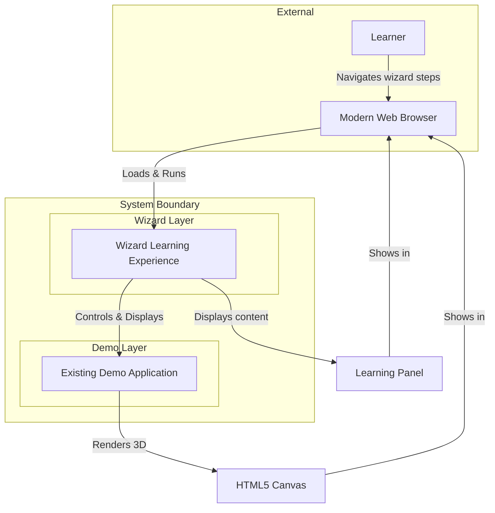
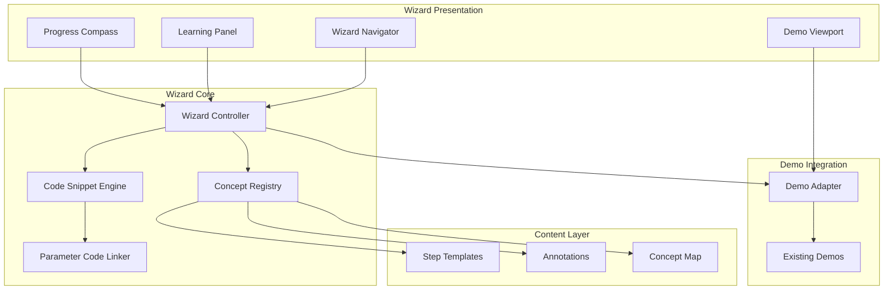
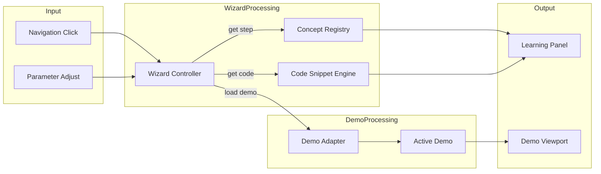

# Architecture Document - Wizard Learning Experience

> This document defines HOW the wizard learning system will be built on top of the existing demo infrastructure. It implements requirements from PRD v2.0 without inventing new features.

---

## Executive Summary

The Wizard Learning Experience is an educational layer built atop the existing 3D animation demo application. The architecture introduces a **WizardController** that orchestrates step-by-step learning content, a **CodeSnippetEngine** that extracts and displays annotated code from the running demos, and a **ConceptRegistry** that organizes learning content by complexity tier. The existing demo infrastructure (ParticleDemo, ObjectDemo, FluidDemo, CombinedDemo) remains unchanged and is consumed by the wizard layer through well-defined interfaces. This separation of concerns allows the educational features to be developed independently while leveraging the proven demo implementations.

---

## Requirements Mapping

> Every architectural element must trace to PRD v2.0 requirements

| PRD Requirement | Architectural Approach | Component(s) |
|-----------------|----------------------|--------------|
| FR-001 (Wizard Navigation) | Step-based state machine with navigation controls | WizardController, WizardNavigator, StepRenderer |
| FR-002 (Code Snippet Display) | Source extraction from demo files with syntax highlighting | CodeSnippetEngine, SnippetExtractor, SyntaxHighlighter |
| FR-003 (Explanatory Annotations) | Annotation metadata linked to code regions | AnnotationSystem, ConceptRegistry |
| FR-004 (Flexible Navigation) | Non-linear step access with prerequisite awareness | WizardNavigator, ConceptMap |
| FR-005 (Live Parameter Connection) | Parameter binding with code highlighting | ParameterCodeLinker, ControlPanel integration |
| FR-006 (Concept Categorization) | Three-tier complexity classification | ConceptRegistry, ComplexityTier enum |
| FR-007 (Integrated Demo Rendering) | Split-view layout with synchronized demo | WizardLayout, DemoViewport |
| NFR-001 (30+ FPS) | Lightweight UI, efficient updates | Existing demo optimization, DOM batching |
| NFR-002 (Browser Compatibility) | Standard HTML/CSS/JS, no experimental APIs | All components |
| NFR-003 (Intuitive UI) | Clear visual hierarchy, progress indicators | WizardLayout, StepRenderer |
| NFR-004 (Maintainability) | Modular architecture, typed interfaces | All components via TypeScript |
| NFR-005 (Accessibility) | Semantic HTML, sufficient contrast | WizardLayout, typography standards |
| NFR-006 (Desktop Responsiveness) | Flexible split-view layout, min 1024px | WizardLayout |

---

## System Context

### Context Diagram



### System Boundaries

| Inside System | Outside System | Integration Type |
|---------------|----------------|------------------|
| Wizard navigation and content | Web Browser | DOM API |
| Code snippet extraction | Source files (bundled) | Static import |
| Demo control and rendering | WebGL via Three.js | Existing Demo interface |
| Annotation content | Bundled JSON/TS | Static data |

### Layer Architecture

The system consists of two distinct layers:

1. **Demo Layer** (Existing): The proven 3D animation demos remain unchanged
2. **Wizard Layer** (New): Educational UI and content management built on top

```
┌─────────────────────────────────────────────────────────────┐
│                     Wizard Layer (New)                       │
│  ┌──────────┐ ┌───────────────┐ ┌─────────────────────────┐ │
│  │  Wizard  │ │ CodeSnippet   │ │     Concept Registry    │ │
│  │Controller│ │   Engine      │ │  (Steps, Annotations)   │ │
│  └────┬─────┘ └───────┬───────┘ └───────────┬─────────────┘ │
│       │               │                     │               │
│  ┌────┴───────────────┴─────────────────────┴────────────┐  │
│  │               WizardLayout (Split View)                │  │
│  └────────────────────────────────────────────────────────┘  │
└─────────────────────────────────────────────────────────────┘
                              │ uses
                              ▼
┌─────────────────────────────────────────────────────────────┐
│                    Demo Layer (Existing)                     │
│  ┌───────────┐ ┌───────────┐ ┌───────────┐ ┌─────────────┐  │
│  │ Particle  │ │  Object   │ │   Fluid   │ │  Combined   │  │
│  │   Demo    │ │   Demo    │ │   Demo    │ │    Demo     │  │
│  └─────┬─────┘ └─────┬─────┘ └─────┬─────┘ └──────┬──────┘  │
│        └─────────────┴─────────────┴───────────────┘        │
│                         │                                    │
│  ┌──────────────────────┴────────────────────────────────┐  │
│  │  Core (DemoRenderer, SceneManager, AnimationLoop)     │  │
│  └───────────────────────────────────────────────────────┘  │
└─────────────────────────────────────────────────────────────┘
```

---

## Architecture Overview

### High-Level Architecture



### Architecture Style

**Pattern**: Layered Architecture with Adapter Pattern

**Rationale**:
- **Layered**: Clear separation between wizard (educational) layer and demo (rendering) layer
- **Adapter**: Demo Adapter provides clean interface for wizard to control existing demos without modification
- Preserves existing demo investment while adding educational features
- See ADR-001 for detailed rationale

---

## Components

### Component: Wizard Controller

| Attribute | Value |
|-----------|-------|
| **Purpose** | Central orchestrator for wizard state, step transitions, and component coordination |
| **PRD Requirements** | FR-001, FR-004 |
| **Technology** | TypeScript |

**Responsibilities**:
- Manage current step state and history
- Coordinate navigation between steps
- Signal step changes to dependent components
- Track learning progress within session

**Interfaces**:
| Direction | Type | Contract |
|-----------|------|----------|
| Input | Method Call | goToStep(stepId: string) |
| Input | Method Call | nextStep(), previousStep() |
| Output | Event | onStepChange(step: WizardStep) |
| Output | Method Call | getCurrentStep(): WizardStep |

**Dependencies**:
- ConceptRegistry: Provides step definitions and ordering
- DemoAdapter: Controls demo based on current step
- CodeSnippetEngine: Retrieves code for current step

---

### Component: Concept Registry

| Attribute | Value |
|-----------|-------|
| **Purpose** | Central repository of learning concepts, steps, and their metadata |
| **PRD Requirements** | FR-001, FR-003, FR-006 |
| **Technology** | TypeScript, Static data structures |

**Responsibilities**:
- Store all wizard step definitions
- Categorize concepts by complexity tier (micro, medium, advanced)
- Provide recommended learning path ordering
- Store annotation content linked to code regions

**Interfaces**:
| Direction | Type | Contract |
|-----------|------|----------|
| Input | Method Call | getStep(stepId: string): WizardStep |
| Input | Method Call | getStepsByTier(tier: ComplexityTier): WizardStep[] |
| Output | Data | Ordered list of all steps |
| Output | Data | Concept prerequisites map |

**Data Structures**:
```typescript
enum ComplexityTier {
  Micro = 'micro',       // Single concept, < 10 lines
  Medium = 'medium',     // Combined concepts, patterns
  Advanced = 'advanced'  // Full feature integration
}

interface WizardStep {
  id: string;
  title: string;
  tier: ComplexityTier;
  demoType: DemoType;
  description: string;
  codeSnippets: CodeSnippetRef[];
  annotations: Annotation[];
  parameters?: ParameterBinding[];
  order: number;
  prerequisites?: string[];
}

interface Annotation {
  id: string;
  lineStart: number;
  lineEnd: number;
  content: string;  // Markdown supported
  highlightType: 'concept' | 'pattern' | 'warning' | 'tip';
}
```

---

### Component: Code Snippet Engine

| Attribute | Value |
|-----------|-------|
| **Purpose** | Extracts, processes, and displays code snippets from demo source files |
| **PRD Requirements** | FR-002, FR-003, FR-005 |
| **Technology** | TypeScript, PrismJS or Shiki for syntax highlighting |

**Responsibilities**:
- Extract code regions from bundled source files
- Apply syntax highlighting for TypeScript/JavaScript
- Overlay annotations on code display
- Highlight code sections linked to parameters

**Interfaces**:
| Direction | Type | Contract |
|-----------|------|----------|
| Input | Method Call | getSnippet(ref: CodeSnippetRef): HighlightedCode |
| Input | Method Call | highlightLines(lineStart, lineEnd) |
| Output | DOM | Rendered code element with annotations |

**Data Structures**:
```typescript
interface CodeSnippetRef {
  sourceFile: string;     // e.g., 'ParticleDemo.ts'
  startLine: number;
  endLine: number;
  highlightLines?: number[];
}

interface HighlightedCode {
  html: string;           // Syntax-highlighted HTML
  plainText: string;      // For accessibility
  lineCount: number;
  annotations: Annotation[];
}
```

---

### Component: Parameter Code Linker

| Attribute | Value |
|-----------|-------|
| **Purpose** | Connects UI parameter controls to their corresponding code locations |
| **PRD Requirements** | FR-005 |
| **Technology** | TypeScript |

**Responsibilities**:
- Map parameter keys to code locations
- Highlight relevant code when parameter is adjusted
- Show code variable names alongside UI controls
- Animate code highlighting on parameter change

**Interfaces**:
| Direction | Type | Contract |
|-----------|------|----------|
| Input | Event | onParameterFocus(key: string) |
| Input | Event | onParameterChange(key: string, value: any) |
| Output | Method Call | highlightCodeForParameter(key: string) |

**Data Structures**:
```typescript
interface ParameterBinding {
  parameterKey: string;   // e.g., 'emissionRate'
  codeLocation: CodeSnippetRef;
  variableName: string;   // e.g., 'this.params.emissionRate'
  explanation: string;    // What this parameter controls
}
```

---

### Component: Demo Adapter

| Attribute | Value |
|-----------|-------|
| **Purpose** | Provides clean interface for wizard to control existing demos |
| **PRD Requirements** | FR-007 |
| **Technology** | TypeScript, Adapter Pattern |

**Responsibilities**:
- Abstract demo lifecycle management for wizard use
- Switch between demo types based on current step
- Forward parameter changes to active demo
- Ensure demo state aligns with wizard step

**Interfaces**:
| Direction | Type | Contract |
|-----------|------|----------|
| Input | Method Call | loadDemoForStep(step: WizardStep) |
| Input | Method Call | setParameter(key: string, value: any) |
| Input | Method Call | resetDemo() |
| Output | Object3D[] | Demo scene objects for rendering |

**Dependencies**:
- All existing Demo implementations (ParticleDemo, ObjectDemo, etc.)
- DemoRenderer, SceneManager (existing core components)

---

### Component: Wizard Navigator

| Attribute | Value |
|-----------|-------|
| **Purpose** | UI component for step navigation and concept browsing |
| **PRD Requirements** | FR-001, FR-004, FR-006 |
| **Technology** | TypeScript, HTML/CSS |

**Responsibilities**:
- Display current position in learning path
- Provide next/previous navigation controls
- Show concept list with complexity indicators
- Allow direct navigation to any step (FR-004)

**Interfaces**:
| Direction | Type | Contract |
|-----------|------|----------|
| Input | Method Call | setCurrentStep(step: WizardStep) |
| Input | Method Call | setSteps(steps: WizardStep[]) |
| Output | Event | onNavigate(stepId: string) |

---

### Component: Learning Panel

| Attribute | Value |
|-----------|-------|
| **Purpose** | Displays educational content: explanations, code, annotations |
| **PRD Requirements** | FR-002, FR-003 |
| **Technology** | TypeScript, HTML/CSS |

**Responsibilities**:
- Render step title and description
- Display code snippets with syntax highlighting
- Show annotations inline or as overlays
- Integrate parameter controls with code highlighting

**Interfaces**:
| Direction | Type | Contract |
|-----------|------|----------|
| Input | Method Call | renderStep(step: WizardStep, code: HighlightedCode) |
| Input | Method Call | highlightParameter(key: string) |
| Output | DOM | Rendered learning content |

---

### Component: Wizard Layout

| Attribute | Value |
|-----------|-------|
| **Purpose** | Manages the split-view layout between demo and learning content |
| **PRD Requirements** | FR-007, NFR-006 |
| **Technology** | TypeScript, CSS Grid/Flexbox |

**Responsibilities**:
- Provide responsive split-view layout
- Balance demo viewport and learning panel
- Handle resizing and layout adjustments
- Ensure both views are visible simultaneously

**Layout Structure**:
```
┌─────────────────────────────────────────────────────────────┐
│  [◀ Prev]   Step 3 of 15: Particle Emission    [Next ▶]     │
├───────────────────────────────┬─────────────────────────────┤
│                               │                             │
│                               │   Particle Emission Rate    │
│                               │   ─────────────────────     │
│      3D Demo Viewport         │   When particles spawn,     │
│      (Canvas + Controls)      │   the emission rate...      │
│                               │                             │
│                               │   ```typescript             │
│                               │   this.params.emissionRate  │
│                               │   ```                       │
│                               │                             │
│                               │   [Slider: Emission Rate]   │
│                               │   ───────●──────────        │
│                               │                             │
├───────────────────────────────┴─────────────────────────────┤
│  ● Micro Concepts    ○ Medium Concepts    ○ Advanced        │
└─────────────────────────────────────────────────────────────┘
```

---

### Component: Demo Viewport

| Attribute | Value |
|-----------|-------|
| **Purpose** | Container for the 3D demo rendering within wizard layout |
| **PRD Requirements** | FR-007 |
| **Technology** | TypeScript, HTML Canvas |

**Responsibilities**:
- Size canvas appropriately within split layout
- Forward input events to demo
- Display FPS and demo status (optional)
- Handle viewport resize events

---

## Data Architecture

### Data Models

The wizard layer primarily uses static configuration data and runtime state. No persistent storage is required (per PRD: out of scope).

#### Entity: WizardState

```
WizardState
├── currentStepId: string
├── stepHistory: string[]         // For back navigation
├── parameterOverrides: Map       // User's parameter adjustments
└── demoState: DemoType           // Currently active demo
```

#### Entity: ConceptData (Static)

```
ConceptData
├── steps: WizardStep[]
├── conceptMap: Map<stepId, prerequisiteIds[]>
├── tierCounts: { micro: number, medium: number, advanced: number }
└── totalSteps: number
```

### Data Flow



---

## Interface Specifications

### Wizard Step Interface

All wizard step data must conform to this structure:

```typescript
interface WizardStep {
  id: string;                    // Unique identifier (e.g., 'particle-emission')
  title: string;                 // Display title
  tier: ComplexityTier;          // micro | medium | advanced
  demoType: DemoType;            // Which demo to display
  description: string;           // Markdown-supported explanation
  learningObjectives: string[];  // What user will learn
  codeSnippets: CodeSnippetRef[];
  annotations: Annotation[];
  parameters?: ParameterBinding[];
  order: number;                 // Position in recommended path
  prerequisites?: string[];      // Optional step dependencies
}
```

### Code Snippet Reference

```typescript
interface CodeSnippetRef {
  id: string;
  sourceFile: string;           // Relative path from src/
  startLine: number;
  endLine: number;
  title?: string;               // Optional snippet title
  focusLines?: number[];        // Lines to emphasize
}
```

### Events

| Event | Publisher | Subscriber(s) | Payload |
|-------|-----------|---------------|---------|
| stepChange | WizardController | LearningPanel, DemoAdapter, Navigator | `{ step: WizardStep }` |
| parameterChange | ControlPanel | WizardController, ParameterCodeLinker | `{ key: string, value: any }` |
| parameterFocus | ControlPanel | ParameterCodeLinker | `{ key: string }` |
| demoLoaded | DemoAdapter | WizardController | `{ demoType: DemoType }` |

---

## Architecture Decision Records

### ADR-001: Layered Architecture with Adapter Pattern

| Attribute | Value |
|-----------|-------|
| **Status** | Accepted |
| **Date** | 2025-12-27 |
| **Deciders** | Architect |

**Context**: The PRD v2.0 requires adding educational features (wizard, code display, annotations) to an existing working demo application. The demos must continue to work unchanged while new UI is added.

**Decision**: Use a layered architecture where the Wizard Layer sits above the Demo Layer, with a Demo Adapter providing a clean integration boundary.

**Consequences**:
- Positive: Existing demo code remains untouched (low risk)
- Positive: Clear separation of concerns (educational vs. rendering)
- Positive: Demo Adapter can be extended for future demo types
- Positive: Wizard can be developed/tested independently
- Trade-off: Slight indirection when controlling demos
- Trade-off: Must maintain two conceptual layers

**Alternatives Considered**:
| Alternative | Rejected Because |
|-------------|------------------|
| Modify demos directly | High risk; demos already working; violates separation of concerns |
| Single monolithic app | Harder to maintain; mixes educational and rendering logic |
| Iframe separation | Overkill; adds complexity for same-origin content |

---

### ADR-002: Bundled Source Code for Snippet Extraction

| Attribute | Value |
|-----------|-------|
| **Status** | Accepted |
| **Date** | 2025-12-27 |
| **Deciders** | Architect |

**Context**: FR-002 requires displaying actual source code from the running demos. Options are: (1) fetch at runtime, (2) bundle with app, (3) hard-code snippets.

**Decision**: Bundle the source files as static assets at build time, extractable by the CodeSnippetEngine at runtime.

**Consequences**:
- Positive: Code is always consistent with running demo (from same build)
- Positive: No network requests needed (NFR-005 portability)
- Positive: Snippets can be extracted dynamically with line numbers
- Trade-off: Increases bundle size (source is already included as compiled JS)
- Trade-off: Build step must include raw source alongside compiled output

**Alternatives Considered**:
| Alternative | Rejected Because |
|-------------|------------------|
| Fetch from server | Violates NFR-005 (no server dependencies) |
| Hard-coded snippets | Snippets would drift from actual code; maintenance burden |
| Source maps | Complex to parse; not designed for display |

**Implementation Note**: Use Vite's raw import (`?raw`) to bundle source files as strings.

---

### ADR-003: Static Syntax Highlighting with Shiki

| Attribute | Value |
|-----------|-------|
| **Status** | Accepted |
| **Date** | 2025-12-27 |
| **Deciders** | Architect |

**Context**: Code snippets must be syntax-highlighted and readable (FR-002). Options include runtime highlighting (PrismJS) or build-time (Shiki).

**Decision**: Use Shiki for syntax highlighting, with tokens generated at runtime from bundled source.

**Consequences**:
- Positive: High-quality VSCode-style highlighting
- Positive: TypeScript support built-in
- Positive: Line highlighting and annotations integrate naturally
- Trade-off: Larger dependency (~200KB for language grammars)
- Trade-off: Initial load parses grammars

**Alternatives Considered**:
| Alternative | Rejected Because |
|-------------|------------------|
| PrismJS | Less accurate TypeScript highlighting; annotation integration harder |
| highlight.js | Similar concerns; less active development |
| Plain monospace | Fails FR-002 (code must be readable and highlighted) |

---

### ADR-004: CSS Grid Layout for Split View

| Attribute | Value |
|-----------|-------|
| **Status** | Accepted |
| **Date** | 2025-12-27 |
| **Deciders** | Architect |

**Context**: FR-007 and NFR-006 require a split-view layout showing demo and learning content simultaneously, minimum 1024px width.

**Decision**: Use CSS Grid for the main layout with flexible column sizing.

**Consequences**:
- Positive: Clean, declarative layout without JavaScript
- Positive: Responsive to container size
- Positive: Supported in all target browsers (NFR-002)
- Trade-off: Less control than JS-based resizers
- Note: No draggable splitter needed (simplicity over configurability)

**Alternatives Considered**:
| Alternative | Rejected Because |
|-------------|------------------|
| Flexbox only | Grid provides better 2D layout control |
| JS-based layout | Over-engineering for fixed layout |
| Absolute positioning | Brittle; harder to maintain |

---

### ADR-005: Concept Registry as Static TypeScript Data

| Attribute | Value |
|-----------|-------|
| **Status** | Accepted |
| **Date** | 2025-12-27 |
| **Deciders** | Architect |

**Context**: Wizard steps, annotations, and concept metadata must be stored and accessed. Options: database, JSON files, TypeScript objects.

**Decision**: Store concept data as typed TypeScript objects, imported directly into the application.

**Consequences**:
- Positive: Full type safety for step definitions
- Positive: IDE support (autocomplete, error checking)
- Positive: No parsing or validation at runtime
- Positive: Content and code reviewed together
- Trade-off: Must recompile to update content
- Trade-off: Non-developers cannot easily edit content

**Alternatives Considered**:
| Alternative | Rejected Because |
|-------------|------------------|
| JSON files | Lose type safety; require runtime parsing |
| Database | Violates NFR-005 (no server dependencies) |
| CMS | Overkill for single-developer project |

---

## Technology Stack

| Layer | Technology | Version | Purpose | License |
|-------|------------|---------|---------|---------|
| Language | TypeScript | 5.x | Type safety, maintainability | Apache 2.0 |
| Build Tool | Vite | 5.x | Bundling, raw imports for source | MIT |
| 3D Rendering | Three.js | 0.160+ | Existing demo infrastructure | MIT |
| Syntax Highlighting | Shiki | 1.x | Code display with TypeScript support | MIT |
| UI Controls | lil-gui | 0.19+ | Parameter adjustment (existing) | MIT |
| Styling | CSS (vanilla) | - | Layout and theming | - |

### New Dependencies for Wizard Layer

| Dependency | Purpose | Size Impact |
|------------|---------|-------------|
| Shiki | Syntax highlighting | ~200KB (grammars) |
| (optional) marked | Markdown parsing for annotations | ~25KB |

---

## Non-Functional Requirements Implementation

### Performance (NFR-001: 30+ FPS)

| Requirement | Approach | Verification |
|-------------|----------|--------------|
| Demo maintains 30+ FPS | Wizard UI updates don't block render loop | FPS monitor during navigation |
| Smooth transitions | CSS transitions for step changes | Visual inspection |
| Lazy snippet rendering | Only render visible code snippets | Profile memory usage |

### Compatibility (NFR-002: Modern Browsers)

| Requirement | Approach | Verification |
|-------------|----------|--------------|
| Chrome, Firefox, Safari, Edge | CSS Grid (98%+ support); ES2020 | Manual testing |
| No experimental APIs | Standard DOM APIs only | Caniuse verification |

### Usability (NFR-003: Intuitive Navigation)

| Requirement | Approach | Verification |
|-------------|----------|--------------|
| First-time navigation < 30s | Clear step indicators, visible controls | User testing |
| Current position visible | Progress bar/step counter always shown | UI review |
| Next step obvious | Prominent "Next" button | Visual hierarchy |

### Maintainability (NFR-004)

| Requirement | Approach | Verification |
|-------------|----------|--------------|
| Content updates simple | TypeScript concept definitions | Developer review |
| Clear module boundaries | One responsibility per component | Architecture review |
| Type safety | Full TypeScript coverage | Compile-time checks |

### Accessibility (NFR-005)

| Requirement | Approach | Verification |
|-------------|----------|--------------|
| 16px minimum font | CSS base font size | Style audit |
| Sufficient contrast | WCAG AA compliant colors | Contrast checker |
| Semantic HTML | Proper heading hierarchy | HTML validator |

### Responsiveness (NFR-006: Desktop)

| Requirement | Approach | Verification |
|-------------|----------|--------------|
| 1024px minimum | CSS min-width, graceful stacking below | Resize testing |
| Split view balance | 50/50 default, adjustable via CSS | Visual inspection |

---

## Integration Points

The wizard layer integrates with the existing demo layer through well-defined interfaces:

| Integration | Direction | Interface | Notes |
|-------------|-----------|-----------|-------|
| Demo Lifecycle | Wizard → Demo | Demo.start(), stop(), reset() | Via DemoAdapter |
| Parameter Control | Wizard → Demo | Demo.setParameter(key, value) | Forwards from ControlPanel |
| Scene Objects | Demo → Wizard | Demo.getSceneObjects() | For rendering |
| Input Events | Wizard → Demo | Demo.onInput(state) | Via InputManager |

---

## Risks and Mitigations

| ID | Risk | Probability | Impact | Score | Mitigation |
|----|------|-------------|--------|-------|------------|
| TR-001 | Source code bundling increases bundle size significantly | Medium | Low | 2 | Only bundle demo source files (~50KB); lazy load if needed |
| TR-002 | Shiki initialization delays first code display | Low | Medium | 2 | Show loading state; consider pre-warming |
| TR-003 | Annotation content maintenance becomes burdensome | Medium | Medium | 4 | Start with minimal annotations; add iteratively |
| TR-004 | Split-view layout feels cramped on 1024px screens | Medium | Low | 2 | Optimize layout; allow panel collapse |
| TR-005 | Step ordering doesn't match natural learning progression | Medium | High | 6 | Iterate on ordering with self-testing; mark as assumption to validate |

---

## Coding Standards

### File Structure (Wizard Layer)

```
src/
├── wizard/
│   ├── WizardController.ts     # State and navigation management
│   ├── ConceptRegistry.ts      # Step definitions and concept data
│   ├── CodeSnippetEngine.ts    # Source extraction and highlighting
│   ├── ParameterCodeLinker.ts  # Parameter-to-code mapping
│   └── DemoAdapter.ts          # Integration with demo layer
├── wizard-ui/
│   ├── WizardLayout.ts         # Split-view container
│   ├── WizardNavigator.ts      # Navigation controls
│   ├── LearningPanel.ts        # Content display
│   └── DemoViewport.ts         # Demo canvas container
├── wizard-data/
│   ├── steps/
│   │   ├── particle-steps.ts   # Particle demo concepts
│   │   ├── object-steps.ts     # Object demo concepts
│   │   └── fluid-steps.ts      # Fluid demo concepts
│   └── index.ts                # Aggregated step registry
└── ... (existing demo structure unchanged)
```

### Naming Conventions

- Wizard components: PascalCase prefixed with context (e.g., `WizardController`, `LearningPanel`)
- Step IDs: kebab-case (e.g., `particle-emission-basics`)
- Event names: camelCase with subject prefix (e.g., `stepChange`, `parameterFocus`)

### Patterns to Follow

- **Observer Pattern**: Events for component communication
- **Adapter Pattern**: DemoAdapter wraps existing demos
- **Registry Pattern**: ConceptRegistry centralizes step data
- **Composition**: UI components composed, not inherited

---

## Glossary

| Term | Definition |
|------|------------|
| Wizard | Step-by-step guided learning experience |
| Step | Single screen/state in the wizard, teaching one concept |
| Concept | A learning unit (e.g., "particle emission rate") |
| Tier | Complexity level: micro, medium, or advanced |
| Annotation | Explanatory text linked to specific code lines |
| Snippet | Extracted portion of source code for display |
| Learning Panel | UI area showing explanations and code |
| Demo Viewport | UI area showing the 3D rendering |

---

## Open Questions

- [x] Q1: How many micro-concepts exist in current demos?
  - Answer: To be enumerated during story creation; architecture supports any number
  - Note: PRD Q4 defers this to architecture phase; recommend starting with 5-7 per demo

- [ ] Q2: Should annotations support interactive elements (e.g., "try this")?
  - Impact: May require richer annotation schema
  - Owner: Developer
  - Recommendation: Start with static text; add interactivity in future iteration

---

## Approval

| Role | Name | Date | Status |
|------|------|------|--------|
| Architect | Winston | 2025-12-27 | Complete |
| Tech Lead | | | Pending |
| Primary Stakeholder | | | Pending |

---

## Workflow Checklist

- [x] All FR requirements have architectural approach
- [x] All NFR requirements have implementation strategy
- [x] System context diagram exists
- [x] Component diagram with clear boundaries
- [x] Data models specified
- [x] At least 3 ADRs documented (5 provided)
- [x] Technology choices justified
- [x] Risks identified with mitigations
- [x] Zero implementation code present

---

**Next Step**: `/scrum` to create User Stories
