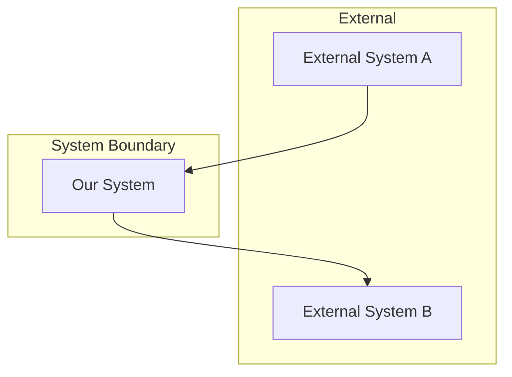
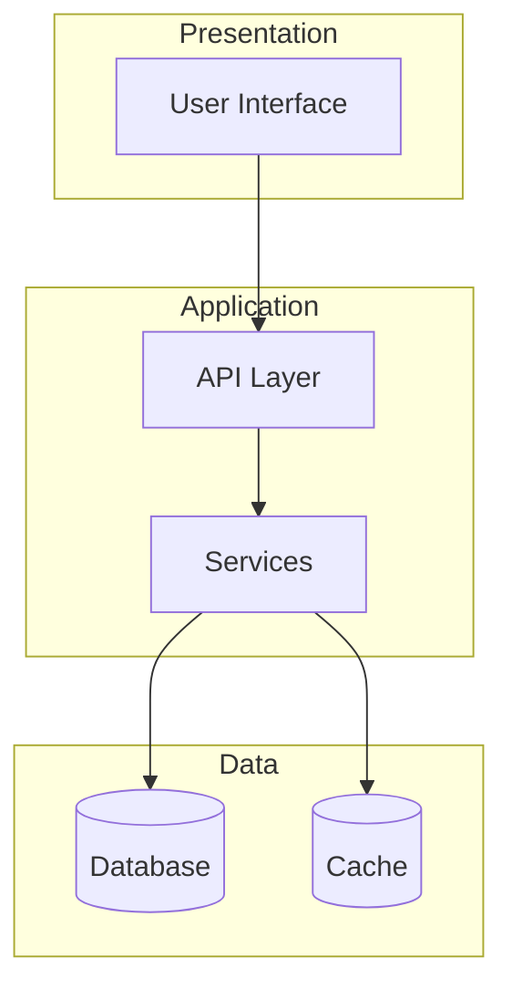
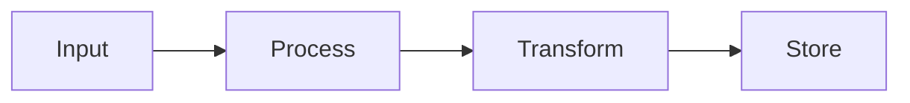

# Architecture Document

## Document Info
- **Created**: YYYY-MM-DD
- **Author**: Architect
- **Status**: Draft | Review | Approved
- **PRD Reference**: `bmad/01-prd/PRD.md`

---

## Executive Summary

_Brief overview of the technical approach and key decisions._

---

## System Context

### Context Diagram



### System Boundaries
_Define what's inside vs outside the system scope._

---

## Architecture Overview

### High-Level Architecture



### Architecture Style
_Describe the overall architectural approach (microservices, monolith, etc.)_

---

## Components

### Component 1: [Name]

**Purpose**: _What this component does_

**Responsibilities**:
- _Responsibility 1_
- _Responsibility 2_

**Interfaces**:
- Input: _Description_
- Output: _Description_

**Dependencies**:
- _Dependency 1_

### Component 2: [Name]
_Repeat structure_

---

## Data Models

### Entity: [Name]

```
Entity Name
├── id: UUID (PK)
├── field1: String
├── field2: Integer
├── created_at: Timestamp
└── updated_at: Timestamp
```

**Relationships**:
- _Entity A_ has many _Entity B_

### Data Flow



---

## Interfaces

### API Endpoints

| Method | Endpoint | Purpose | Request | Response |
|--------|----------|---------|---------|----------|
| GET | /api/resource | List resources | - | `Resource[]` |
| POST | /api/resource | Create resource | `CreateDTO` | `Resource` |

### Events

| Event | Publisher | Subscriber(s) | Payload |
|-------|-----------|---------------|---------|
| _event.name_ | _Component_ | _Component(s)_ | _Schema_ |

---

## Technical Decisions

### ADR-001: [Decision Title]

**Status**: Proposed | Accepted | Deprecated | Superseded

**Context**: _Why this decision was needed_

**Decision**: _What was decided_

**Consequences**:
- Positive: _Benefit_
- Negative: _Tradeoff_

**Alternatives Considered**:
1. _Alternative 1_: Rejected because _reason_

---

## Technology Stack

| Layer | Technology | Version | Purpose |
|-------|------------|---------|---------|
| Runtime | _e.g., Node.js_ | _e.g., 18.x_ | _Purpose_ |
| Framework | _e.g., Express_ | _e.g., 4.x_ | _Purpose_ |
| Database | _e.g., PostgreSQL_ | _e.g., 15_ | _Purpose_ |

---

## Non-Functional Requirements Implementation

### Performance
_How NFRs for performance will be met_

### Security
_Security measures and patterns_

### Scalability
_How the system will scale_

### Reliability
_Fault tolerance and recovery_

---

## Integration Points

| System | Direction | Protocol | Authentication |
|--------|-----------|----------|----------------|
| _External API_ | Outbound | REST/HTTPS | API Key |

---

## Risks and Mitigations

| Risk | Probability | Impact | Mitigation |
|------|-------------|--------|------------|
| _Technical risk 1_ | H/M/L | H/M/L | _Strategy_ |

---

## Open Questions

- [ ] _Technical question requiring resolution_

---

## Glossary

| Term | Definition |
|------|------------|
| _Term_ | _Definition_ |

---

## Approval

| Role | Name | Date | Signature |
|------|------|------|-----------|
| Architect | | | |
| Tech Lead | | | |

---

**Next Step**: `/scrum` to create User Stories
