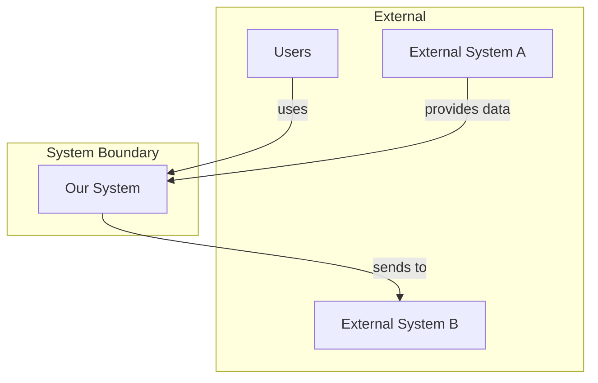
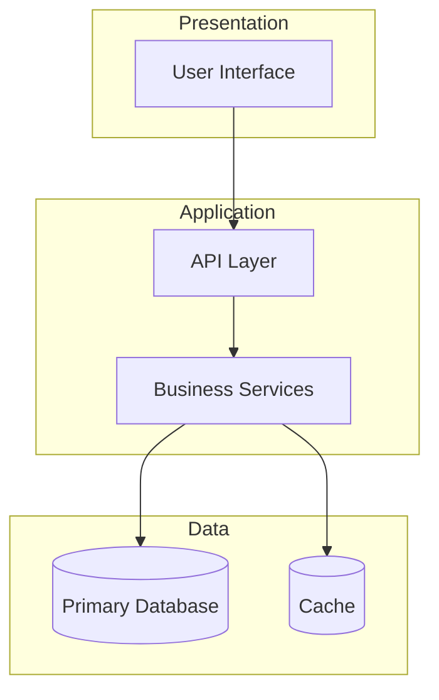
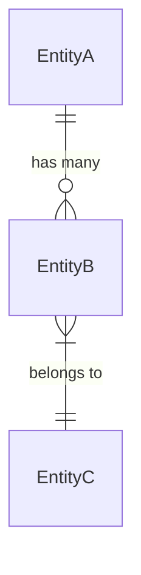
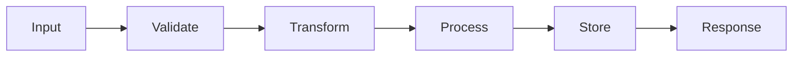

# Architecture Document

> This document defines HOW the system will be built. It implements requirements from the PRD without inventing new features.

---

## Executive Summary

[2-3 sentence overview of the technical approach and key architectural decisions]

---

## Requirements Mapping

> Every architectural element must trace to PRD requirements

| PRD Requirement | Architectural Approach | Component(s) |
|-----------------|----------------------|--------------|
| FR-001 | [How addressed] | [Component] |
| FR-002 | [How addressed] | [Component] |
| NFR-001 | [How addressed] | [Pattern/Technology] |

---

## System Context

### Context Diagram



### System Boundaries

| Inside System | Outside System | Integration Type |
|---------------|----------------|------------------|
| [Internal component] | [External system] | [API/Event/File] |

---

## Architecture Overview

### High-Level Architecture



### Architecture Style

**Pattern**: [Monolith / Microservices / Serverless / etc.]

**Rationale**: [Why this pattern was chosen - reference ADR]

---

## Components

### Component: [Name]

| Attribute | Value |
|-----------|-------|
| **Purpose** | [Single responsibility description] |
| **PRD Requirements** | FR-001, FR-002 |
| **Technology** | [Framework/Language] |

**Responsibilities**:
- [Responsibility 1]
- [Responsibility 2]

**Interfaces**:
| Direction | Type | Contract |
|-----------|------|----------|
| Input | [REST/Event/etc.] | [Schema reference] |
| Output | [REST/Event/etc.] | [Schema reference] |

**Dependencies**:
- [Component X]: [Purpose of dependency]

### Component: [Name 2]

[Repeat structure for each component]

---

## Data Architecture

### Data Models

#### Entity: [Name]

```
EntityName
├── id: UUID (PK)
├── field1: String (required)
├── field2: Integer (optional)
├── status: Enum [active, inactive]
├── created_at: Timestamp
└── updated_at: Timestamp
```

**Constraints**:
- [Constraint 1]
- [Constraint 2]

**Relationships**:


### Data Flow



---

## Interface Specifications

### API Endpoints

| Method | Endpoint | Purpose | Request | Response | Auth |
|--------|----------|---------|---------|----------|------|
| GET | /api/v1/resource | List resources | Query params | `Resource[]` | Bearer |
| POST | /api/v1/resource | Create resource | `CreateDTO` | `Resource` | Bearer |
| GET | /api/v1/resource/:id | Get single | Path param | `Resource` | Bearer |
| PUT | /api/v1/resource/:id | Update | `UpdateDTO` | `Resource` | Bearer |
| DELETE | /api/v1/resource/:id | Delete | Path param | 204 | Bearer |

### Request/Response Schemas

```json
// CreateDTO
{
  "field1": "string (required)",
  "field2": "number (optional)"
}

// Resource
{
  "id": "uuid",
  "field1": "string",
  "field2": "number",
  "createdAt": "ISO8601",
  "updatedAt": "ISO8601"
}
```

### Events (if applicable)

| Event | Publisher | Subscriber(s) | Payload |
|-------|-----------|---------------|---------|
| resource.created | ResourceService | NotificationService | `{ id, field1 }` |

---

## Architecture Decision Records

### ADR-001: [Decision Title]

| Attribute | Value |
|-----------|-------|
| **Status** | Proposed / Accepted / Deprecated |
| **Date** | YYYY-MM-DD |
| **Deciders** | [Who made this decision] |

**Context**: [Why this decision was needed]

**Decision**: [What was decided]

**Consequences**:
- ✅ [Positive consequence]
- ⚠️ [Trade-off or negative consequence]

**Alternatives Considered**:
| Alternative | Rejected Because |
|-------------|------------------|
| [Option A] | [Reason] |
| [Option B] | [Reason] |

### ADR-002: [Decision Title]

[Repeat structure - minimum 3 ADRs required]

---

## Technology Stack

| Layer | Technology | Version | Purpose | License |
|-------|------------|---------|---------|---------|
| Runtime | [e.g., Node.js] | [e.g., 20.x LTS] | [Purpose] | [MIT] |
| Framework | [e.g., Express] | [e.g., 4.x] | [Purpose] | [MIT] |
| Database | [e.g., PostgreSQL] | [e.g., 15] | [Purpose] | [PostgreSQL] |
| Cache | [e.g., Redis] | [e.g., 7.x] | [Purpose] | [BSD] |

---

## Non-Functional Requirements Implementation

### Performance (NFR-001)

| Requirement | Approach | Verification |
|-------------|----------|--------------|
| [Response time < Xms] | [Caching, query optimization] | [Load test] |

### Security (NFR-002)

| Requirement | Approach | Verification |
|-------------|----------|--------------|
| [Authentication] | [JWT/OAuth] | [Security audit] |
| [Data encryption] | [AES-256 at rest] | [Compliance check] |

### Scalability (NFR-003)

| Requirement | Approach | Verification |
|-------------|----------|--------------|
| [Handle X users] | [Horizontal scaling] | [Load test] |

### Availability (NFR-004)

| Requirement | Approach | Verification |
|-------------|----------|--------------|
| [99.9% uptime] | [Multi-AZ deployment] | [Monitoring] |

---

## Integration Points

| System | Direction | Protocol | Auth | Data Format | Error Handling |
|--------|-----------|----------|------|-------------|----------------|
| [External API] | Outbound | REST/HTTPS | API Key | JSON | Retry with backoff |

---

## Risks and Mitigations

| ID | Risk | Probability | Impact | Score | Mitigation |
|----|------|-------------|--------|-------|------------|
| TR-001 | [Technical risk] | H/M/L | H/M/L | [P×I] | [Strategy] |

---

## Coding Standards

### File Structure
```
src/
├── components/     # [Purpose]
├── services/       # [Purpose]
├── models/         # [Purpose]
├── utils/          # [Purpose]
└── tests/          # [Purpose]
```

### Naming Conventions
- Files: [convention]
- Classes: [convention]
- Functions: [convention]
- Variables: [convention]

### Patterns to Follow
- [Pattern 1]: [When to use]
- [Pattern 2]: [When to use]

---

## Glossary

| Term | Definition |
|------|------------|
| [Term] | [Definition] |

---

## Open Questions

- [ ] Q1: [Technical question]
  - Impact: [What it affects]
  - Owner: [Who decides]

---

## Approval

| Role | Name | Date | Status |
|------|------|------|--------|
| Architect | | | Pending |
| Tech Lead | | | Pending |
| Security | | | Pending |

---

## Workflow Checklist

- [ ] All FR requirements have architectural approach
- [ ] All NFR requirements have implementation strategy
- [ ] System context diagram exists
- [ ] Component diagram with clear boundaries
- [ ] Data models specified
- [ ] At least 3 ADRs documented
- [ ] Technology choices justified
- [ ] Risks identified with mitigations
- [ ] Zero implementation code present

---

**Next Step**: `/scrum` to create User Stories
